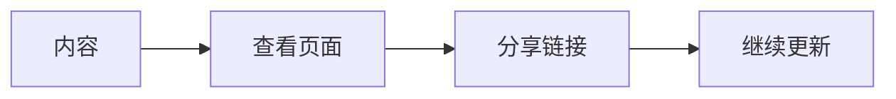

# 把想法，写成下一步。

> 纸鹊官方示例，非真实项目数据。

一份项目报告，不止记录完成了什么，也让下一步变得清楚。

## 这一周的三个进展

| 事项 | 当前状态 |
| --- | --- |
| 明确页面的阅读对象 | 已整理 |
| 完成首屏内容初稿 | 待评审 |
| 验证手机阅读体验 | 准备中 |

## 让信息有清晰的顺序

先表达结论，再说明依据，最后列出行动。

## 下一步

邀请同事评审，把反馈写回同一个作品，让讨论与内容一起积累。
